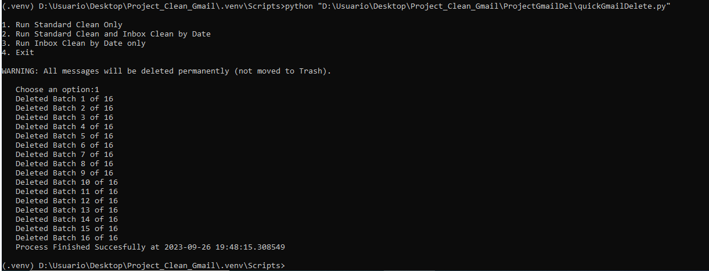

# ProjectGmailDel
Project to automatically delete Spam emails in Gmail

In order to run this program, first execute the API allowance Step as indicated here: https://developers.google.com/gmail/api/quickstart/python

Attention: Thhis scrip will delete all the emails on the Categories SPAM, SOCIAL, FORUMS , UPDATES, PROMOTIONS and TRASH.

Also, it will delete all the emails Before and After a given date from the MAIN folder.

So Use with Caution at your own risk!!!

