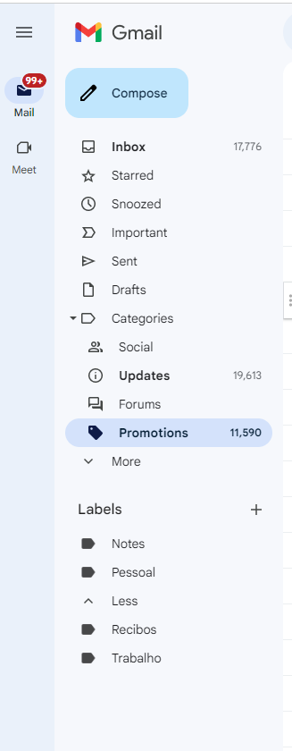

# ProjectGmailDel
Project to automatically delete Spam emails in Gmail

In order to run this program, first execute the API allowance Step as indicated here: https://developers.google.com/gmail/api/quickstart/python

Attention: This script will delete all the emails on the Categories SPAM, SOCIAL, FORUMS , UPDATES, PROMOTIONS and TRASH.

Also, it will delete all the emails Before and After a given date from the MAIN folder.

They will be deleted FOREVER!

So Use with Caution at your own risk!!!

GMAIL View Example of the Inbox Before running the Process

View Example of the Process running

View Example of the Inbox After running the Process

